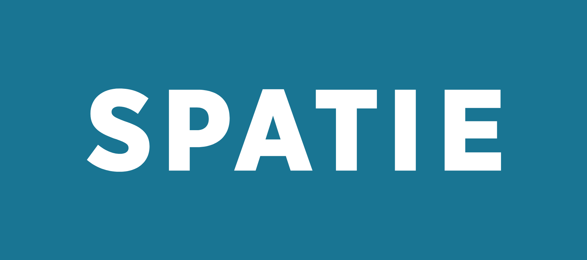

<div style="display:flex; align-items: center">
  
  <h1 style="position:relative; top: -6px" >Movie Quotes API</h1>
</div>

---

Movie Quotes API is a RESTful API that provides a collection of movie quotes. It allows users to create, read, update, delete quotes and interact with each other through real time notifications. The API also provides endpoints for user authentication and authorization. The API is built using Laravel, a PHP web application framework.

#
### Table of Contents
* [Prerequisites](#prerequisites)
* [Tech Stack](#tech-stack)
* [Getting Started](#getting-started)
* [Migrations](#migration)
* [Development](#development)
* [Database Design Diagram](#database-design-diagram)
* [API Documentation](#api-documentation)


#
### Prerequisites

* *PHP@8.2*
* *MYSQL@8.0.36*
* *composer@2.7.1*

#
### Tech Stack

* [Laravel@11.x](https://laravel.com/docs/11.x) - back-end framework
* [Laravel Reverb@beta](https://laravel.com/docs/11.x/reverb) - package for broadcasting live notifications
* [Spatie Translatable@6.0](https://spatie.be/docs/laravel-translatable/v6) - package for API authentication
* [Spatie Query Builder@5.8](https://spatie.be/docs/laravel-query-builder/v5/introduction) - package for API query building
* [Spatie Media library@11.4](https://spatie.be/docs/laravel-medialibrary/v11/introduction) - package for media file management
* [Laravel Sanctum@4.0](https://laravel.com/docs/11.x/sanctum) - package for API authentication
* [Laravel Pest@2.34](https://pestphp.com/docs/installation) - package for testing
* [Laravel Socialite@5.14.0](https://laravel.com/docs/11.x/socialite) - package for OAuth authentication


#
### Getting Started

1 . Clone the repository
```sh
git clone https://github.com/RedberryInternship/movie-quotes-back-luka-trapaidze.git
```
   
2 . Next step requires you to run *composer install* in order to install all the dependencies.
 ```sh
 composer install
 ```
   
3 . Now we need to set our env file. Go to the root of your project and execute this command.
```sh
cp .env.example .env
```
   
4 . And now you should provide **.env** file all the necessary environment variables:


####
**MYSQL:**
>DB_CONNECTION=mysql

>DB_HOST=127.0.0.1

>DB_PORT=3306

>DB_DATABASE=*****

>DB_USERNAME=*****

>DB_PASSWORD=*****

####
**FILESYSTEM:**
>FILESYSTEM_DISK=public

####
**MAIL:**
>MAIL_MAILER=smtp

>MAIL_HOST=...

>MAIL_PORT=...

>MAIL_USERNAME=...

>MAIL_PASSWORD=*****

>MAIL_ENCRYPTION=...

>MAIL_FROM_ADDRESS=...

####
**Sanctum:**
>SANCTUM_STATEFUL_DOMAINS=...

>SESSION_DOMAIN=...

####
**Reverb:**
>BROADCAST_CONNECTION=reverb

>BROADCAST_DRIVER=reverb

>REVERB_APP_ID=*****

>REVERB_APP_KEY=*****

>REVERB_APP_SECRET=*****

>REVERB_HOST=...

>REVERB_PORT=...

>REVERB_SCHEME=http | https

####
**Socialite:**
>GOOGLE_CLIENT_ID=*****

>GOOGLE_CLIENT_SECRET=*****

>GOOGLE_REDIRECT=...

after setting up **.env** file, execute:
```sh
php artisan config:cache
```
in order to cache environment variables.

Now execute in the root of you project following:
 ```sh
php artisan key:generate
 ```
Which generates auth key.

##### Now, you should be good to go!


#
### Migration
if you've completed getting started section, then migrating database if fairly simple process, just execute:
```sh
php artisan migrate
```


#
### Development

You can run Laravel's built-in development server by executing:

```sh
php artisan serve
```


#
### Database Design Diagram


[Database Design Diagram](https://drawsql.app/teams/solo-176/diagrams/movie-quotes "drawsql.app")


#

### API Documentation

[API Documentation](https://documenter.getpostman.com/view/33136231/2sA3XLEPPg#c8264a92-1ed2-4593-afdb-d7f9556603cd "Postman")